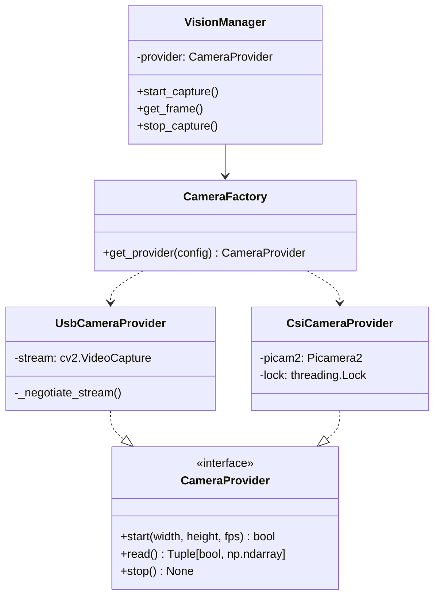

```markdown
# FEATURE SPEC: Camera Hardware Abstraction Layer (HAL)
**Date:** 2026-02-07
**Status:** Approved
**Target File:** `docs/specs/camera_hal_spec.md`

## 1. THE VISION
**Objective:** Decouple the `VisionManager` from specific hardware drivers to support both the Raspberry Pi Camera Module 3 (IMX708) via `picamera2` and legacy USB Webcams via `opencv-python`.

**Core Requirements:**
1.  **Factory Pattern:** Runtime selection of camera backend (`usb` vs `csi`) via configuration.
2.  **API Preservation:** `VisionManager` public methods (`start_capture`, `get_frame`, `generate_mjpeg`) must remain signature-compatible.
3.  **Thread Safety:** Encapsulate `picamera2`'s concurrency requirements (GLib context, single instance) within the provider.
4.  **Legacy Support:** The proven USB negotiation logic (V4L2, MJPG formatting) must be preserved exactly in the new USB provider.

## 2. ARCHITECTURE
The solution introduces a **Provider Layer** between the Service and the Hardware.

### Class Structure


## 3. FILE INVENTORY

| File Path | Action | Description |
| :--- | :--- | :--- |
| `src/hardware/camera/base.py` | **Create** | Abstract Base Class defining the contract. |
| `src/hardware/camera/usb_provider.py` | **Create** | Encapsulates existing OpenCV V4L2 logic. |
| `src/hardware/camera/csi_provider.py` | **Create** | New `picamera2` implementation for IMX708. |
| `src/hardware/camera/factory.py` | **Create** | Logic to select and instantiate providers. |
| `src/hardware/camera/__init__.py` | **Modify** | Expose Factory and Providers. |
| `src/services/vision_manager.py` | **Refactor** | Replace `cv2.VideoCapture` with `CameraProvider`. |
| `src/core/config.py` | **Modify** | Add `CAMERA_INTERFACE` configuration. |

## 4. DETAILED IMPLEMENTATION SPEC

### A. The Interface (`src/hardware/camera/base.py`)
Must adhere to `system_constraints.md` (Type Hints, Google Docstrings).

```python
from abc import ABC, abstractmethod
from typing import Tuple, Optional
import numpy as np

class CameraProvider(ABC):
    """Abstract base class for camera hardware providers."""

    @abstractmethod
    def start(self, width: int, height: int, fps: int) -> bool:
        """Initialize camera resource with specific parameters.

        Args:
            width: Capture width.
            height: Capture height.
            fps: Capture framerate.

        Returns:
            True if initialized successfully.
        """
        pass

    @abstractmethod
    def read(self) -> Tuple[bool, Optional[np.ndarray]]:
        """Blocking read for the next frame.

        Returns:
            Tuple containing (success_flag, frame_bgr).
        """
        pass

    @abstractmethod
    def stop(self) -> None:
        """Release camera resource and cleanup."""
        pass
```

### B. USB Provider (`src/hardware/camera/usb_provider.py`)
**Constraint Compliance:** Break down the large negotiation logic to satisfy the 50-line limit.

*   **Method `start`:** Calls `_try_index(0)` then iterates 1-5 if failed.
*   **Method `_try_index`:** Encapsulates the specific V4L2/MJPG setup.
    1.  `cv2.VideoCapture(index, cv2.CAP_V4L2)`
    2.  `set(FOURCC, MJPG)`
    3.  `set(RES/FPS)`
    4.  Double-read handshake.
*   **Method `read`:** Wraps `self.stream.read()`.

### C. CSI Provider (`src/hardware/camera/csi_provider.py`)
**Thread Safety:** `picamera2` is not thread-safe for configuration. Initialization happens in `start()` (caller thread), reading happens in `read()` (capture thread).

*   **Imports:** Wrap `import picamera2` in `try/except` to prevent crashes on non-Pi environments.
*   **Attributes:** `self.picam2`, `self.lock` (threading.Lock).
*   **Method `start`:**
    1.  Initialize `Picamera2(device_interface=0)`.
    2.  Configure `lores` stream for requested width/height (RGB888).
    3.  `self.picam2.start()`.
*   **Method `read`:**
    ```python
    try:
        # capture_array is blocking, effectively acting as our timing loop
        frame_rgb = self.picam2.capture_array("lores")
        # Convert RGB to BGR for OpenCV compatibility
        return True, cv2.cvtColor(frame_rgb, cv2.COLOR_RGB2BGR)
    except Exception:
        return False, None
    ```

### D. The Factory (`src/hardware/camera/factory.py`)

```python
import os
from .base import CameraProvider
from .usb_provider import UsbCameraProvider

# Attempt import of CSI provider
try:
    from .csi_provider import CsiCameraProvider
    _CSI_AVAILABLE = True
except ImportError:
    _CSI_AVAILABLE = False

def get_camera_provider() -> CameraProvider:
    """Factory method to instantiate the correct camera provider.
    
    Uses CAMERA_INTERFACE env var: 'csi', 'usb', or 'auto'.
    """
    interface = os.getenv('CAMERA_INTERFACE', 'auto').lower()

    if interface == 'csi' and _CSI_AVAILABLE:
        return CsiCameraProvider()
    
    if interface == 'auto' and _CSI_AVAILABLE:
        # Simple check: if libcamera-hello works, default to CSI
        # For now, simplistic try/except instantiation strategy
        try:
             provider = CsiCameraProvider()
             return provider
        except Exception:
             pass # Fallback to USB

    return UsbCameraProvider()
```

### E. Vision Manager Refactor (`src/services/vision_manager.py`)
**Refactoring Goals:**
1.  Remove `self.stream: cv2.VideoCapture`.
2.  Add `self.provider: CameraProvider`.
3.  Update `start_capture`:
    ```python
    self.provider = get_camera_provider()
    if self.provider.start(width, height, fps):
        # ... logic to start thread ...
    ```
4.  Update `_capture_loop`:
    ```python
    ret, frame = self.provider.read()
    ```
5.  Update `stop_capture`:
    ```python
    if self.provider:
        self.provider.stop()
    ```

## 5. CONFIGURATION SCHEMA
Add to `src/core/config.py` (or load from `.env`):

| Variable | Values | Default | Description |
| :--- | :--- | :--- | :--- |
| `CAMERA_INTERFACE` | `usb`, `csi`, `auto` | `auto` | Forces specific driver backend. |
| `CAMERA_WIDTH` | Integer | `640` | Default stream resolution. |
| `CAMERA_HEIGHT` | Integer | `480` | Default stream resolution. |
| `CAMERA_FPS` | Integer | `30` | Default framerate. |

## 6. IMPLEMENTATION STEPS
1.  **Preparation:** Create `src/hardware/camera/` package.
2.  **Base:** Implement `CameraProvider` ABC.
3.  **USB:** Port logic from `vision_manager.py` to `usb_provider.py`. **Critical:** Verify strict adherence to the existing negotiation sequence.
4.  **CSI:** Implement `csi_provider.py` with `picamera2` guards.
5.  **Factory:** Implement selection logic.
6.  **Integration:** Switch `VisionManager` to use the Factory.
7.  **Testing:**
    *   Set `CAMERA_INTERFACE=usb` -> Verify Webcam.
    *   Set `CAMERA_INTERFACE=csi` -> Verify Module 3.

## 7. RISK MITIGATION
*   **Constraint Violation (Max 50 lines):** The legacy USB negotiation logic is verbose (~60 lines). It MUST be broken into helper methods (`_init_capture_object`, `_configure_stream`) within `UsbCameraProvider`.
*   **Performance:** `picamera2` returns RGB. `cv2.cvtColor` takes CPU time.
    *   *Mitigation:* The Pi 4B CPU handles 640x480 conversions easily. If optimization is needed, we can request BGR directly from `picamera2` if supported, or use `cv2.COLOR_RGB2BGR` on the GPU (future scope).
*   **Dependency:** `picamera2` is a system package. It cannot be installed via `pip` on Windows/Mac. The `try/except ImportError` block in the factory is critical for cross-platform development.

---
✅ **Spec Created:** `docs/specs/camera_hal_spec.md`
```